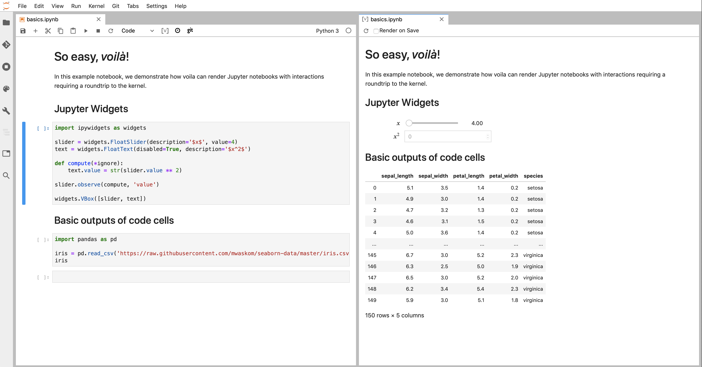
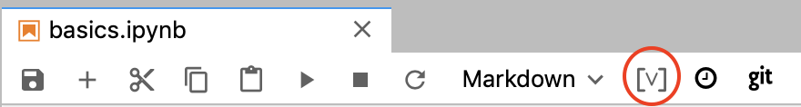
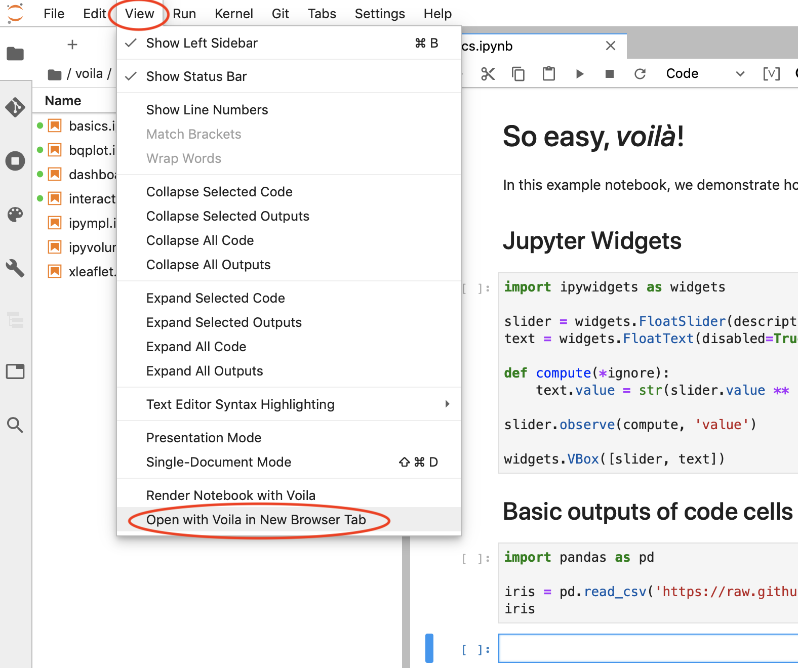

Interactive Dashboards from notebooks with Voilà
================================================

See https://voila.readthedocs.io/en/stable/using.html for full Voilà
documentation.

You can create interactive dashboards from Jupyter notebooks. Dashboards
can be displayed in the new tab within Notebooks or in a new browser
tab. This option is really great for presentations: you can show tables,
images, interactive graphs while hiding the code. See example of Voilà
dashboard below:

   anaconda_cloud_1

To try some tutorial notebooks, clone voila git repo:
``https://github.com/QuantStack/voila`` and open the ``notebooks``
folder.

Render with Voilà in the new tab within Jupyter
-----------------------------------------------

While editing notebook, clcik on the ‘[v]’ button, as shown below:

   anaconda_cloud_1

Render with Voila in the new browser tab
----------------------------------------

   anaconda_cloud_1
