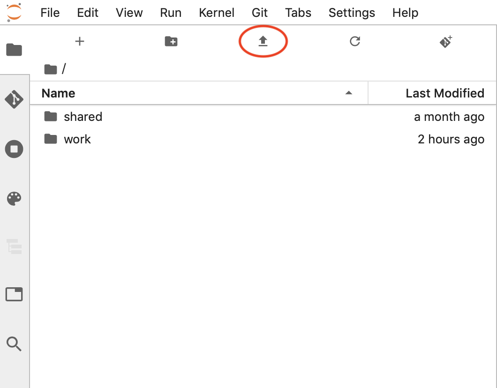
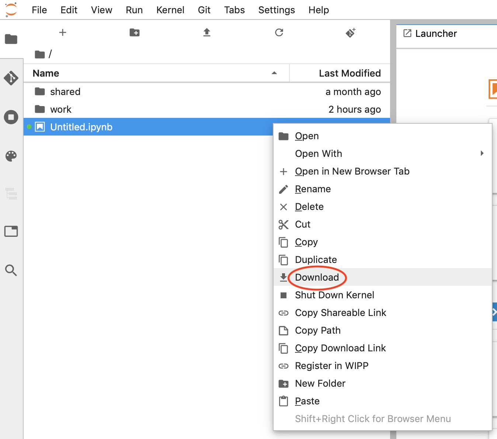

File Management
===============

Important folders
-----------------

While working in Notebooks, it is important to keep in mind the folder
structure. When logging into Notebooks, users see two folders in the
file browser on the left: ``shared`` and ``work``.

-  ``shared`` folder is the symbolic link to ``/opt/shared``, which is
   reserved for shared storage across all apps. Currently, there are two
   folders inside of ``shared``: ``notebooks`` and ``wipp``.

   -  ``notebooks`` is the shared folder for all users of notebooks
      across the deployemnt. That allows to store some common notebooks,
      code and datasets and collaborate on them with other users of
      Notebooks
   -  ``wipp`` contains file storage for WIPP, including Image
      Collections, CSV collections, registered notebooks, Stitching
      vectors and Pyramids. Keep in mind that this folder is in the
      read-only mode; if you need to add new image collection, please
      use WIPP UI.

-  ``work`` is the users’ persistent storage. All files in that folder
   will persist the notebook restarts and is the place to keep your
   work.

All the files and folders created in the home folder outside of
``shared`` and ``work`` will be deleted on notebook restart, which
happen after a period of inactivity (15-60 minutes).

File uploads
------------

To upload a file, click on the upload button in file panel on the left:

   anaconda_cloud_1

You can upload multiple files, but you cannot upload folders. Workaround
for uploading folders is to use Git integration or creating archive and
uploading it and later unarchiving.

File downloads
--------------

To download file, right-click on it in the Files panel on the left

   anaconda_cloud_1

You can not download multiple files at once. You can not download
folders. As a workaround, put your files/folders to archive and then
download archive.

Deleting folders
----------------

To protect users from accidentaly deleting the folder, JupyterLab made a
decision to block non-empty folder deletion with right-click
(https://github.com/jupyterlab/jupyterlab/issues/835). Unfortunately,
until the issue is fixed, you would have to delete everything from
inside the folder manually *or* use the Termianl to delete the folder.
In Terminal you can run the command: ``rm -rf <folder_path>`` to delete
the folder.
