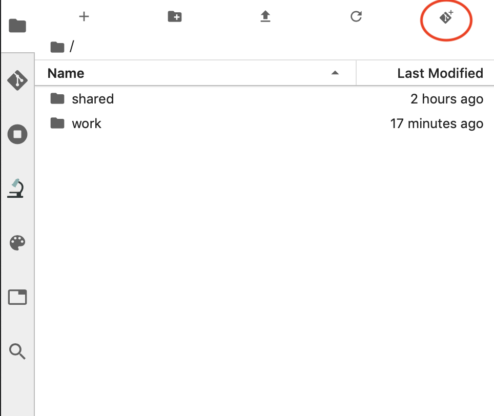
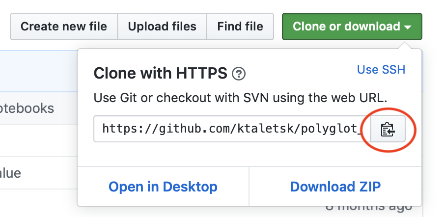
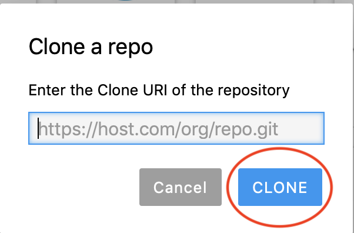
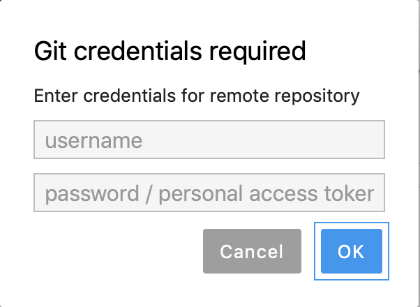
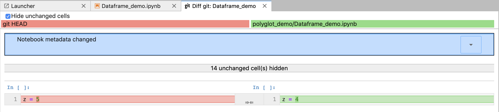
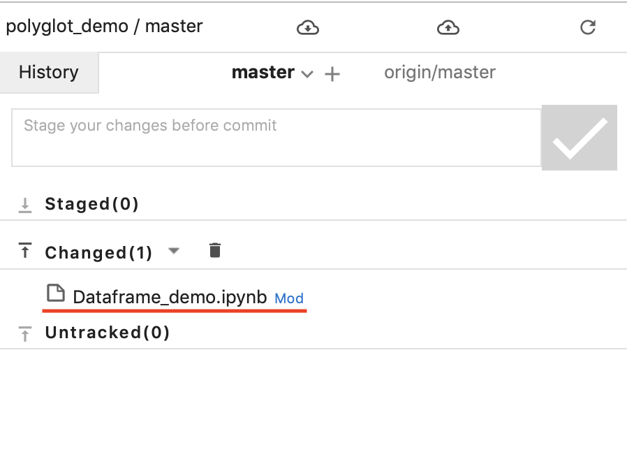
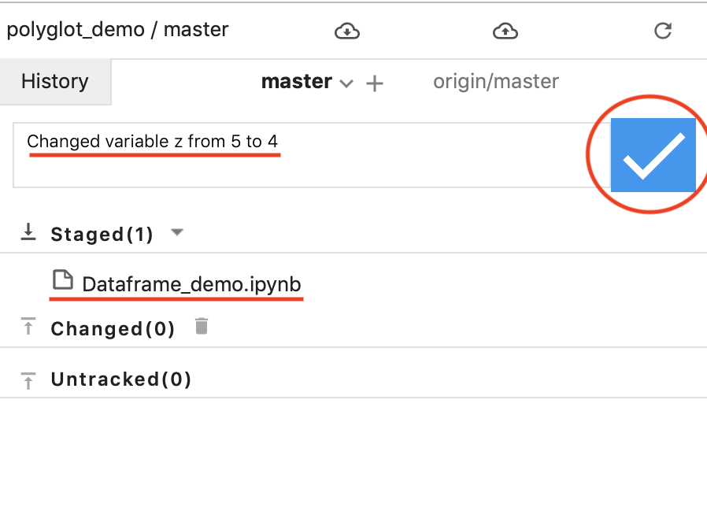
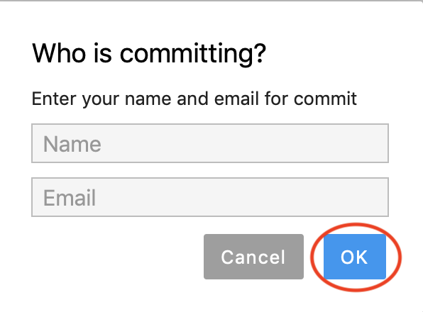
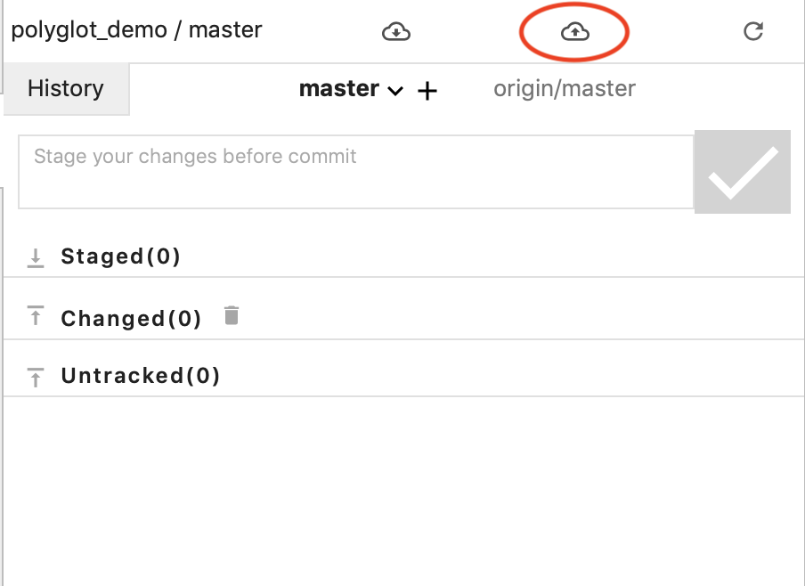

Git integration
===============

Git is a free and open source distributed version control system
designed to handle everything from small to very large projects with
speed and efficiency.

Experienced git users may prefer to use Terminal. That option is always
available alongside the UI version. The easier version for most users is
the UI version (jupyterlab-git). Follow instructions below on how to use
UI version. To learn more about git, go to https://git-scm.com

Git Clone
---------

To start working with remote git repository, you first need to clone it
to JupyterLab. In the file manager, click on the ‘Git Clone’ button, as
shown below

   git_1

In the dialog, that opens after that, type or paste the link to your git
repository. For example, if hosted on GitHub, click the green ‘Clone or
download’ button and then copy the url to paste it to the form.

   git_2

   git_2

If the repository you are trying to clone is in the private repository,
you will be prompted to enter your credentials:

   git_3

Git Commit
----------

After you make some changes to your git repository, you may want to save
your work and/or share with others. To do that, you need to first commit
your changes to git.

See changes in the notebook
~~~~~~~~~~~~~~~~~~~~~~~~~~~

To see the latest ``diff`` (new changes since the last commit), click
‘git’ button in the top bar as shown below:

   git_4

You will see the output similar to one shown below:

   git_5

Previous version is shown in red on the left and the latest version is
shown in green on the right

Commit changes
~~~~~~~~~~~~~~

Click git tab in the left panel to see the list of files that have
changed since the last commit

   git_6

Click the arrow up button to add the file to a staging area for new
commit *or* click trash bin button to discard changes on that file

Once you have all the files you want to stage for a new commit, type the
commit message in the input field on top of the panel. After that click
blue checkmark button to create a commit.

   git_7

If you are commiting for the first time, you would be asked to type in
your name and email. If commiting to Gihub, use the same name and email
that you have on Github to properly attribute your commit to you.

   git_8

Push commit
~~~~~~~~~~~

Finally, push commit to remote repository. You will be asked to type
your login and password.

   git_9
