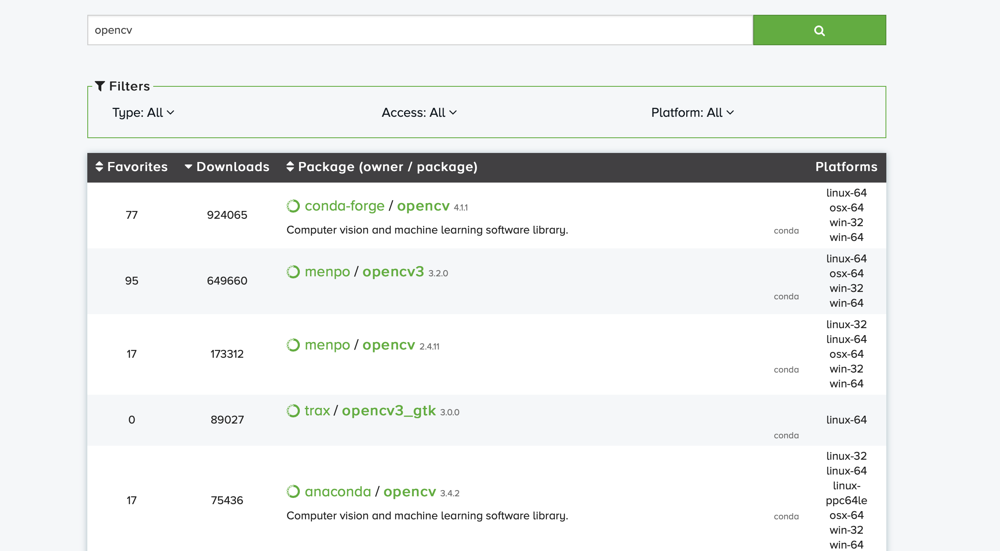
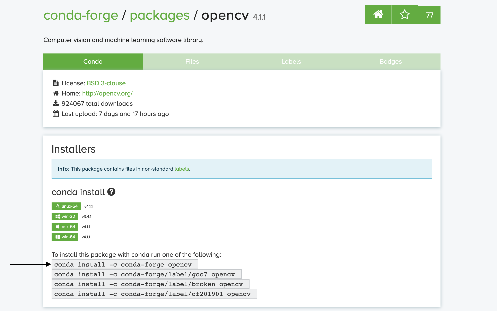
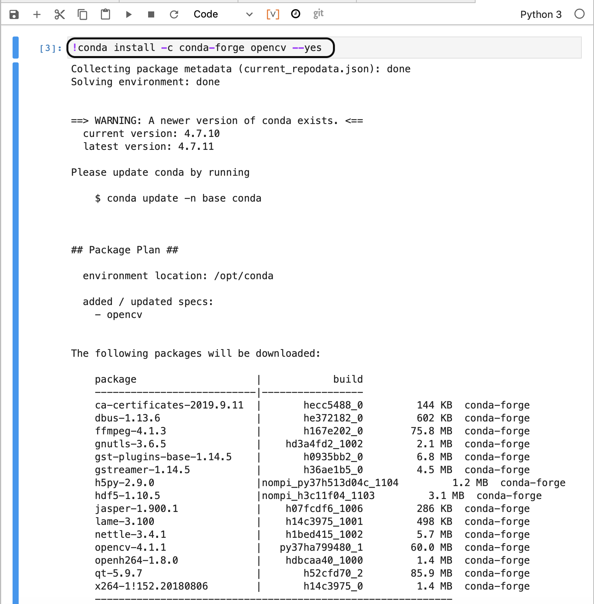
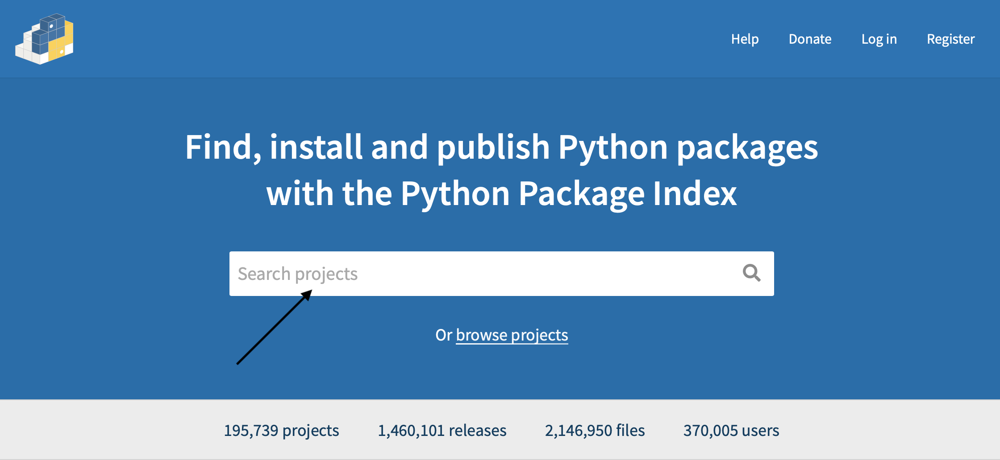
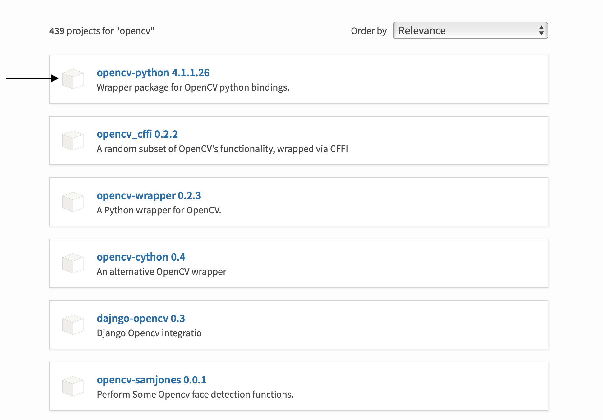
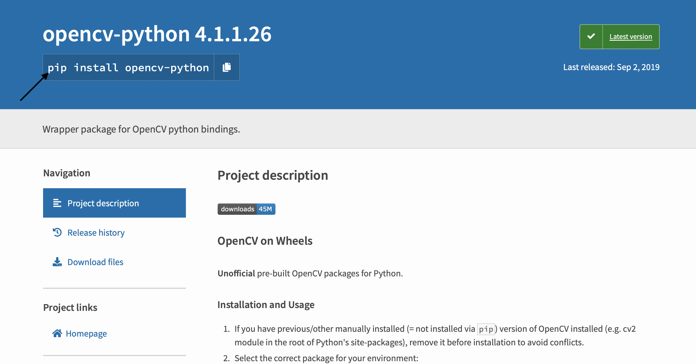
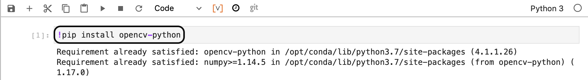
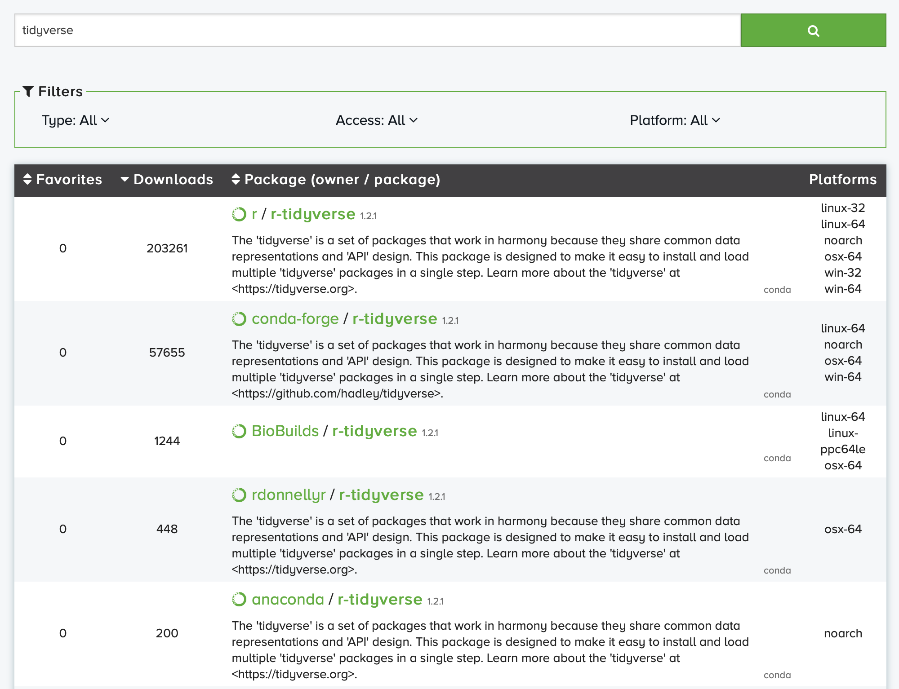
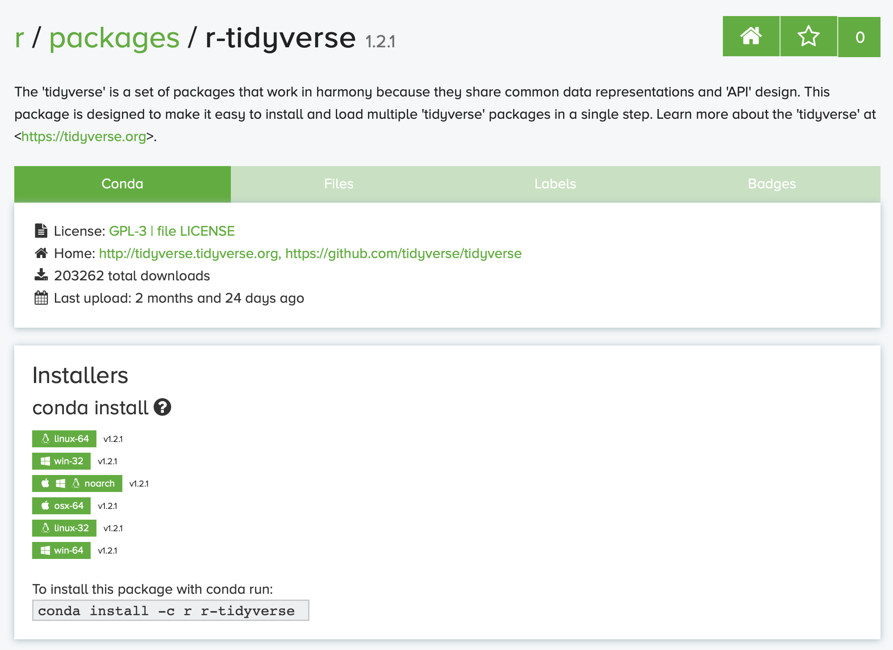

Installing new packages
=======================

Since Polus Notebooks are running in the container environment it has a
fixed set of packages and libraries installed into it for all users. Of
course, it cannot possibly include all existing libraries, so you might
want to install something necessary for your research. Here is the
walkthrough explaining how to install new package for each of the
supported language kernels.

Python 3
--------

Python packages are managed with ``conda`` package manager. You can use
both ``conda`` or ``pip`` to install and update new packages

With ``conda``
~~~~~~~~~~~~~~

1. Use `Anaconda Cloud <https://anaconda.org>`__ to search for package
   you are interested in

   anaconda_cloud_1

2. Choose the package you are looking for. Most of the community
   packages are published through ``conda-forge`` account

   anaconda_cloud_2

3. Copy the install command and paste it to the notebook cell

   anaconda_cloud_3

You have to append ``--yes`` to the end of the command

   anaconda_cloud_4

With ``pip``
~~~~~~~~~~~~

1. Use `Python Package Index (PyPi) <https://pypi.org>`__ to search for
   package you are interested in

   pypi_1

2. Choose the package you are looking for.

   pypi_2

3. Copy the install command and paste it to the notebook cell

   pypi_3

You have to use exclamation mark before the command to let Jupyter know
that this is shell command

   pypi_4

You can specify the version to install using ``=<version>`` afer name of
the package

.. code:: sos

    !pip install opencv-python=4.1.1.26

R
-

You can use both ``conda`` or ``R`` to install and update new packages

With Anaconda
~~~~~~~~~~~~~

1. Use `Anaconda Cloud <https://anaconda.org>`__ to search for R
   packages you are interested in

   anaconda_cloud_1

2. Choose the package you are looking for. Many R packages are published
   through ``r/`` or ``conda-forge/`` repos and their names start with
   ``r-``

   r_anaconda_cloud\_

3. Copy the install command and paste it to the notebook cell

   r_anaconda_cloud_3

You have to append ``--yes`` to the end of the command

.. code:: sos

    system("conda install -c r r-tidyverse --yes", intern=TRUE)

From CRAN
~~~~~~~~~

Install packages from CRAN-like repositories or from local files using
``install.packages("<PACKAGE_NAME>")`` command

.. code:: sos

    install.packages("tidyverse")

More documentation on ``install.packages`` available here:
https://www.rdocumentation.org/packages/utils/versions/3.6.1/topics/install.packages

Julia
-----

Java
----

You can add maven dependencies at runtime using magic command
``%maven``. Full list of supported magic commands is
`here <https://github.com/SpencerPark/IJava/blob/master/docs/magics.md>`__.

.. code:: sos

    %mavenRepo scijava.public https://maven.scijava.org/content/groups/public
    %maven net.imagej:imagej:2.0.0-rc-71
    %maven net.imagej:imagej-notebook:0.7.1

You can search `Maven Central <https://search.maven.org>`__ for
available packages

Octave
------

`Octave Forge <https://octave.sourceforge.io>`__ is a central location
for development of packages for GNU Octave, similar to Matlab’s
toolboxes. To install a package, use the pkg command from the Octave
prompt by typing:

.. code:: sos

    pkg install -forge package_name
    pkg load package_name

C++
---

C++ does not have a built-in package manager. There are multiple
existing package manager and if you are interested we may support one of
them in the future.

