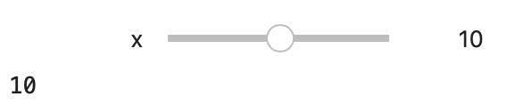

Interactive widgets and visulizations
=====================================

Notebooks come preinstalled with multiple visualization and widget
libraries. See the list of examples below

Python
------

`Jupyter Widgets <https://github.com/jupyter-widgets/ipywidgets>`__
~~~~~~~~~~~~~~~~~~~~~~~~~~~~~~~~~~~~~~~~~~~~~~~~~~~~~~~~~~~~~~~~~~~

Interactive Widgets for the Jupyter Notebook
https://ipywidgets.readthedocs.io

.. code:: sos

    from __future__ import print_function
    from ipywidgets import interact, interactive, fixed, interact_manual
    import ipywidgets as widgets
    
    def f(x):
        return x
    
    interact(f, x=10);

.. parsed-literal::

    interactive(children=(IntSlider(value=10, description='x', max=30, min=-10), Output()), _dom_classes=('widget-…

The interactive widget will appear:

   interactive-widget-1

`Bokeh <https://docs.bokeh.org/en/latest/index.html>`__
~~~~~~~~~~~~~~~~~~~~~~~~~~~~~~~~~~~~~~~~~~~~~~~~~~~~~~~

Interactive BokehJS plots controlled from Python

R
-

htmlwidgets: enable interactive widgets

highcharter: R interface to Highcharts

dygraphs: time series charting

visnetwork: graph data visualization with vis.js

d3heatmap: interactive heatmaps with D3

plotly: Interactive graphics with D3

rbokeh: R interface to BokehJS

networkd3: graph data visualization with D3

Data Table: tabular data display with sorting and search

threejs: 3D scatterplots and globes

rglwidget: render RGL scenes

