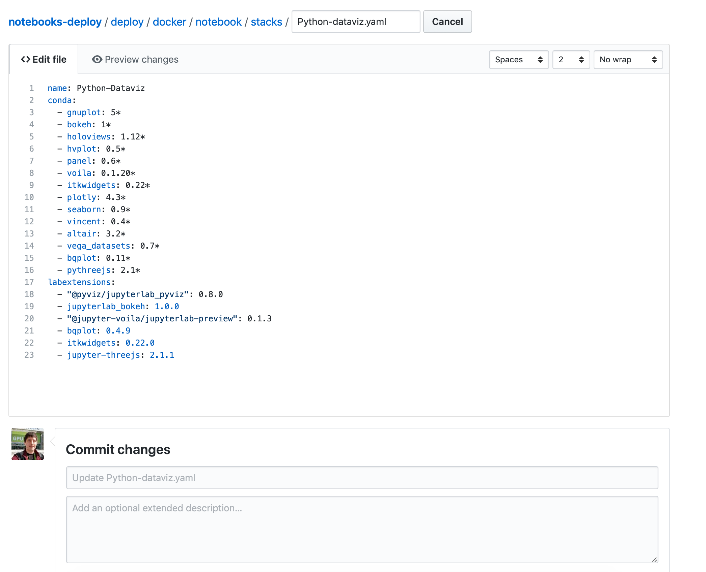

Choosing modular Notebook image
===============================

Starting from version 0.6.0 Polus Notebooks use system of modular images. 
Modular images allows users to choose only required packages and language kernels.
This keeps the size of Docker images small and allows for more flexibility and features be added if group of users want those features.

Using modular containers
------------------------

When logging into JupyterHub users are greeted with the form that asks them to choose from the list of features they would like to see. 
Choose as many of them as you need (could choose none). The corresponding modular container image will be created for you.
The first time you use any particular image, it may take a couple minutes to pull, but after that it will be cached and should start immediately.

Updating or adding new packages into existing stack
---------------------------------------------------

If you would like to update some package or add new package to the existing stack, you first need to find the corresponding .yaml file at `deploy/docker/notebook/stacks`.
Then, if you use GitHub, just click 'Edit this file' button and update version of the package, or add new line with the new package.

If you using git, you first need to fork repo, clone fork to your computer, commit your changes and open PR on Github.

In either case, PR with proposed change will be open and reviewed by Polus Notebooks team and, if approved, will appear in the corresponding stack shortly after.
