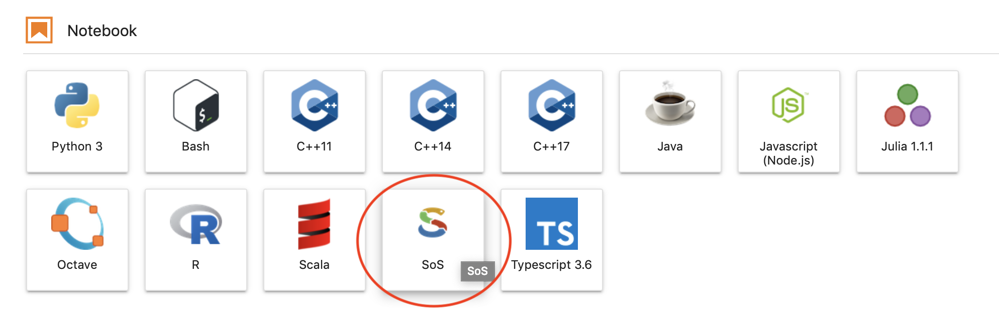

Polyglot features
=================

Available language kernels
--------------------------

Python 3
~~~~~~~~

Polus Notebooks use ```ipython`` language
kernel <https://github.com/ipython/ipykernel>`__ for Python

Current version of Python installed is 3.7.3. Python packages are
managed with ``conda`` package manager. You can use both ``conda`` or
``pip`` to install and update new packages

R
~

Polus Notebooks use ```irkernel`` language
kernel <https://github.com/IRkernel/IRkernel>`__ for R.

Julia
~~~~~

Polus Notebooks use ```IJulia`` language
kernel <https://github.com/JuliaLang/IJulia.jl>`__ for Julia

Java
~~~~

Polus Notebooks use ```IJava`` language
kernel <https://github.com/SpencerPark/IJava>`__ for Java

Octave
~~~~~~

Polus Notebooks use ```octave_kernel`` language
kernel <https://github.com/Calysto/octave_kernel>`__ for Octave

C++
~~~

Polus Notebooks use ```xeus-cling`` language
kernel <https://github.com/QuantStack/xeus-cling>`__ for C++

Bash
~~~~

Polus Notebooks use ```bash_kernel`` language
kernel <https://github.com/takluyver/bash_kernel>`__ for Bash

Scala
~~~~~

Polus Notebooks use ```almond`` language kernel <https://almond.sh>`__
for Scala

Javascript
~~~~~~~~~~

Polus Notebooks use ```IJavascript`` language
kernel <https://github.com/n-riesco/ijavascript>`__ for Javascript

Typescript
~~~~~~~~~~

Polus Notebooks use ```ITypescript`` language
kernel <https://nearbydelta.github.io/itypescript/>`__

Polyglot notebooks
------------------

`Script of Scripts (SoS) <https://vatlab.github.io>`__ enables
communication between multiple language kernels in the same notebook.
That means that you can create notebooks which will have a code in
multiple languages working together, i.e. you can read document using
Python, run data analysis in Java and visualize results in R.

Create polyglot notebook
~~~~~~~~~~~~~~~~~~~~~~~~

To create Polyglot SoS notebook, click SoS icon in launcher



   interactive-widget-1

Variable exchange
~~~~~~~~~~~~~~~~~

SoS extends Jupyter with more
`magics <https://ipython.readthedocs.io/en/stable/interactive/magics.html>`__
commands like ``%command``. Here we show the two most important
commands: ``%put`` and ``%get``.

.. code:: sos

    #Create variable in Python
    x = 42

.. code:: sos

    %put x
    #Share variable with SoS for ither languages to use

.. code:: sos

    %get x
    #Read variable from R

.. code:: sos

    x


.. raw:: html

    42


See `SoS
documentation <https://vatlab.github.io/sos-docs/notebook.html#content>`__
for more details

