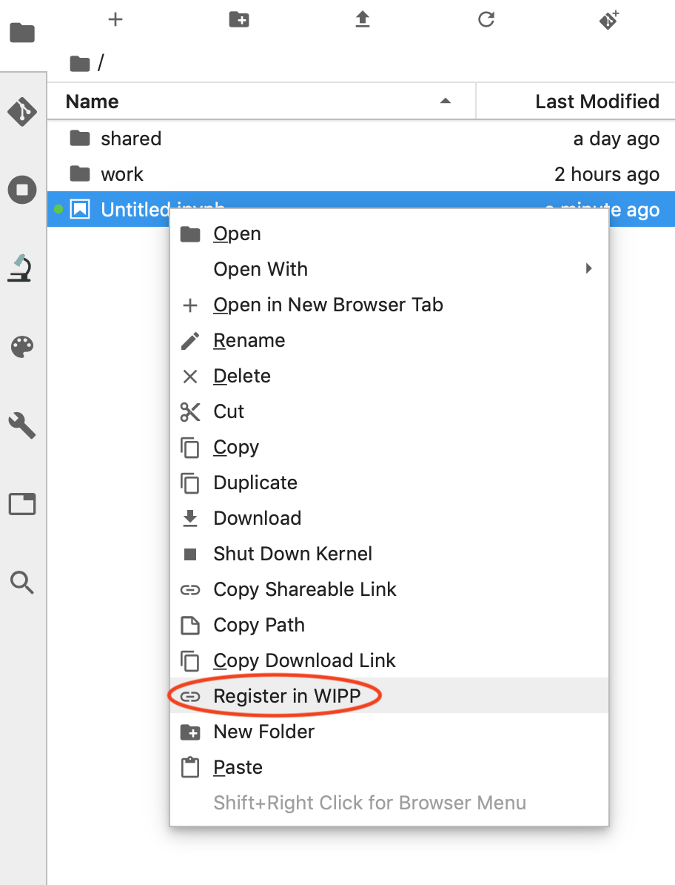
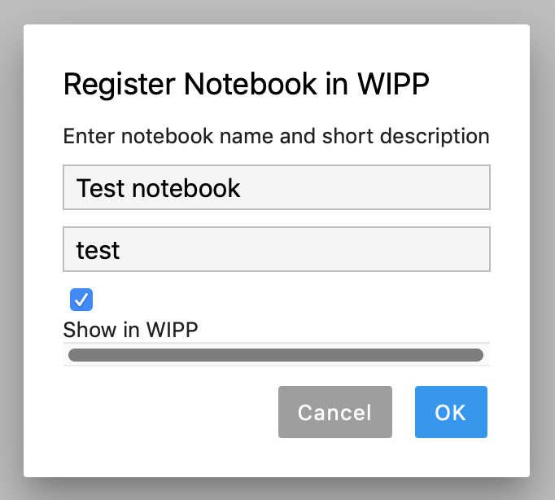
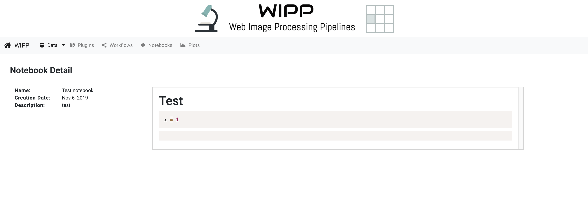
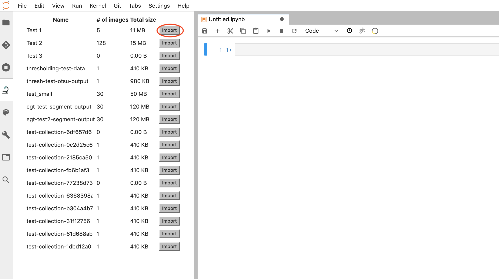
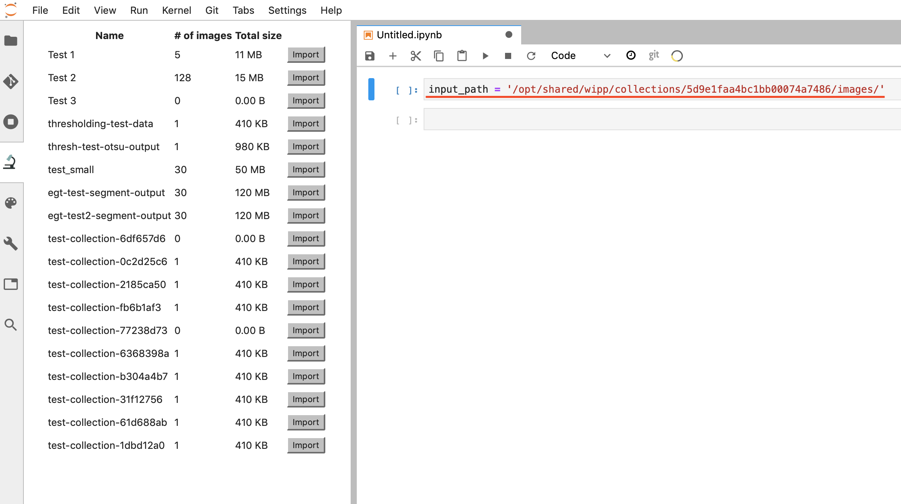

WIPP Integration
================

Register Notebook in WIPP
-------------------------

Jupyter notebooks can be easily converted into WIPP plugins given input
and output path variables are defined in the notebook.

To send notebook from Jupyter to WIPP, right-click on the notebook in
the file browser and choose ‘Register in WIPP’

   register_in_wipp

Enter unique notebook name and some description

   git_1

Click ‘OK’ and notebook will be added to WIPP.

   git_1

Import Image Collections from WIPP
----------------------------------

Click on the button with microscope on the left panel: this will open
WIPP tab in JupyterLab. You will see the list of all available Image
Collections from WIPP.

If you wish to import the collection, click ‘Import’ button next to it.
If you would like to see more information about the collection, click on
its name to open collection in WIPP

   git_1

If you click ‘Import’, a new cell will be added to the currently open
notebook or console. The cell also configured to be used in Notebook
plugin - when running resulting notebook as plugin ``input_path`` will
be substituted with the input image collection in the WIPP Workflow.

   git_1
